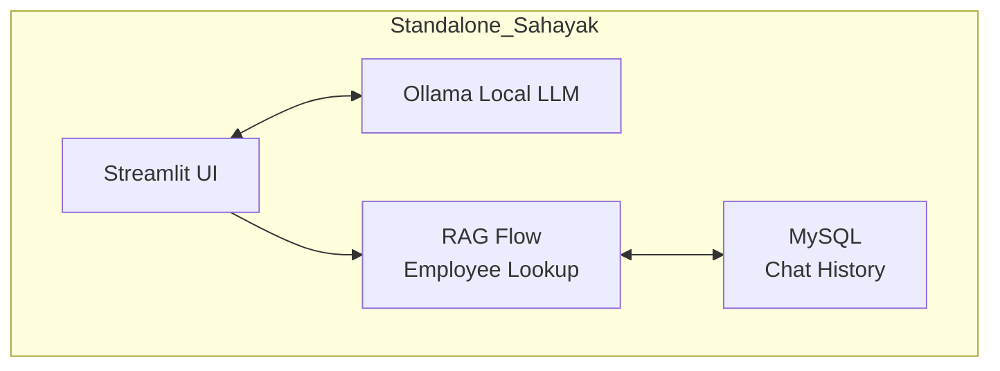

# 🤖 Standalone Sahayak

**AI-powered employee assistant** with local LLM inference, persistent chat history in MySQL, and lightweight RAG-style employee lookup. Built for internal enterprise demos.

---

## ✨ Key Features

| Feature | Description |
|---|---|
| **🔒 100% Local** | Ollama runs locally - **no cloud API**, privacy-preserving |
| **💾 Persistent Memory** | Chat history stored in **MySQL** - resume conversations |
| **🧠 RAG-Style Lookup** | Employee database search + LLM context-aware answers |
| **🎯 Session Memory** | Conversation context maintained per session |
| **🤖 Model Selection** | Switch between Ollama models (llama3.1, deepseek-r1, gemma3) |
| **🎨 Clean UI** | Streamlit sidebar with configuration + glass morphism design |
| **🏢 Enterprise Ready** | Production-style layout for internal demos |


## 🏗️ Architecture



## 🧠 How It Works (RAG Flow)
User asks: "Who is the manager of engineering?"
↓

App searches employee database for "manager engineering"
↓

Retrieves matching record: {"name": "Arun Kumar", "role": "Engineer", "dept": "Hardware"}
↓

Builds context: "Employee: Arun Kumar, Role: Engineer, Dept: Hardware"
↓

Sends to Ollama LLM with query
↓

LLM generates natural response: "Arun Kumar is the Engineer in Hardware department..."
↓

Response stored in MySQL chat_history table


---

## 📊 Tech Stack

| Layer | Technology |
|---|---|
| **Frontend** | Streamlit (Python web UI) |
| **LLM** | Ollama (llama3.1:8b, deepseek-r1:8b, gemma3:12b) |
| **Database** | MySQL (chat_history + employee data) |
| **ORM** | SQLAlchemy (database sessions) |
| **Data** | Pandas (employee lookup) |
| **HTTP** | Requests (Ollama API calls) |
| **Language** | Python 3.10+ |

---

## 🏗️ Project Structure
standalone-sahayak/
├── app.py # Main Streamlit app (200+ lines)
├── requirements.txt # Python dependencies
├── README.md # This file
├── LICENSE # MIT License
├── .gitignore # Git ignore rules
├── .env.example # Environment template
├── .streamlit/
│ └── secrets.toml # Local credentials (NOT committed)
└── images/
└── screenshot.png # UI screenshot

---

## 🚀 Quick Start

### Prerequisites

- ✅ Python 3.10+
- ✅ MySQL Server (running)
- ✅ Ollama (running locally or on reachable host)

### 1. Clone Repository

```bash
git clone https://github.com/chandutharun/standalone-sahayak.git
cd standalone-sahayak
```

### 2. Create Virtual Environment

```bash
python -m venv venv
source venv/bin/activate  # On Windows: venv\Scripts\activate
```

### 3. Install Dependencies

```bash
pip install -r requirements.txt
```

### 4. Configure Database

**Create MySQL database:**

```sql
CREATE DATABASE sahayak_db;
```

**App auto-creates `chat_history` table if missing:**
```sql
CREATE TABLE chat_history (
    id INT AUTO_INCREMENT PRIMARY KEY,
    session_id VARCHAR(128) NOT NULL,
    role VARCHAR(20) NOT NULL,
    content TEXT NOT NULL,
    model VARCHAR(100) NOT NULL,
    sources TEXT NULL,
    created_at TIMESTAMP DEFAULT CURRENT_TIMESTAMP
);
```

### 5. Configure Secrets

**Create `.streamlit/secrets.toml` locally:**

```toml
OLLAMA_SERVER_IP = "192.168.100.66"

[mysql]
host = "localhost"
user = "sahayak"
password = "your_password"
database = "sahayak_db"
```

⚠️ **DO NOT commit this file!** Already in `.gitignore`.

### 6. Start Ollama

```bash
# In separate terminal
ollama serve
```

**Pull model if needed:**
```bash
ollama pull llama3.1:8b
```

### 7. Run App

```bash
streamlit run app.py
```

**Access at:** `http://localhost:8501`

---

## 🎯 Features Demo

### Employee Lookup (RAG)
User: "What is Arun Kumar's staff ID?"
Bot: "Arun Kumar's staff ID is APPLE1001. He works in the Hardware department as an Engineer in Chennai."


### Normal Chat

User: "How do I reset my password?"
Bot: "To reset your password, contact your IT administrator or use the self-service portal..."


---

## 🔒 Security Features

| Feature | Description |
|---|---|
| **Local LLM** | No code/data sent to cloud API |
| **MySQL Auth** | Database credentials in `.streamlit/secrets.toml` |
| **Session Isolation** | Per-session conversation memory |
| **No External Calls** | All inference local via Ollama |

---

## 📊 Database Schema

**chat_history table:**

| Column | Type | Description |
|---|---|---|
| `id` | INT | Primary key |
| `session_id` | VARCHAR(128) | Unique session identifier |
| `role` | VARCHAR(20) | "user" or "assistant" |
| `content` | TEXT | Message content |
| `model` | VARCHAR(100) | Ollama model used |
| `sources` | TEXT | Employee data context (JSON) |
| `created_at` | TIMESTAMP | When message was stored |

---

## 🛠️ Configuration

### Environment Variables (Optional)

Create `.env` file:

```env
OLLAMA_SERVER_IP=192.168.100.66
MYSQL_HOST=localhost
MYSQL_USER=sahayak
MYSQL_PASSWORD=your_password
MYSQL_DATABASE=sahayak_db
```

### Model Selection

**Available Ollama models (in code):**

| Model | Size | Accuracy | Speed | RAM Required |
|---|---|---|---|---|
| **llama3.1:8b** | 8B | 85% | Fast | 8GB |
| **deepseek-r1:8b** | 8B | 88% | Fast | 8GB |
| **gemma3:12b** | 12B | 90% | Medium | 16GB |
| **deepseek-r1:70b** | 70B | 95%+ | Slow | 64GB+ |

**Recommendation:** Use `llama3.1:8b` for testing.

---

## 🧪 Test Queries
"What is Arun Kumar's staff ID?" ← Employee lookup

"Who works in Bengaluru?" ← Employee search

"Tell me about Priya Nair" ← Employee lookup

"How do I install Python?" ← Normal chat

"What is machine learning?" ← Normal chat

---

## 📝 Troubleshooting

### Ollama not connecting

```bash
# Check Ollama is running
curl http://localhost:11434/api/version

# If fails, start Ollama
ollama serve
```

### MySQL connection error

```bash
# Check MySQL is running
mysql -u sahayak -p

# Verify database exists
SHOW DATABASES;
```

### Module not found

```bash
# Reinstall dependencies
pip install -r requirements.txt --force-reinstall
```

---

## 🤝 Contributing

Contributions welcome! To contribute:

1. Fork repository
2. Create feature branch: `git checkout -b feature/new-feature`
3. Make changes
4. Commit: `git commit -m "Add new feature"`
5. Push: `git push origin feature/new-feature`
6. Open Pull Request

---

## 📄 License

MIT License - see [LICENSE](LICENSE) file for details

---


## 👤 Author


**Tharun K**  
AI Developer / Red Teamer
📍 Bengaluru, Karnataka, India  
🔗 GitHub: [@chandutharun](https://github.com/chandutharun)


---
## ⭐ Show Your Support

If you found this project helpful, please **give it a star!**

(https://github.com/chandutharun/standalone-sahayak)

---
